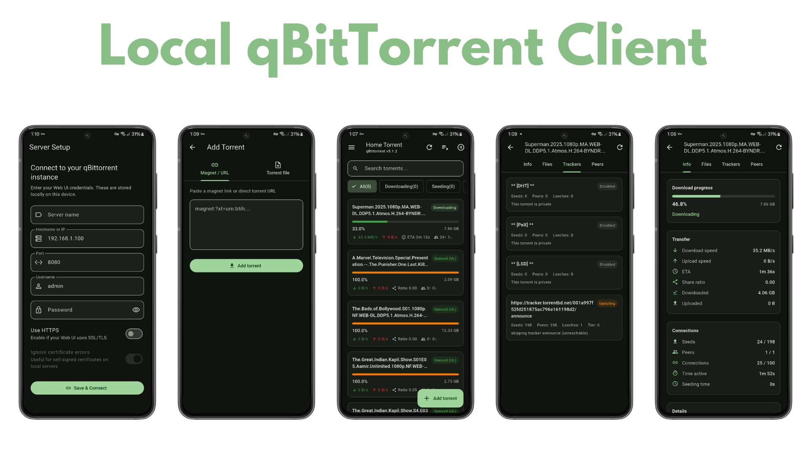

# Local qBittorrent Client

A simple and lightweight mobile application for controlling and monitoring your qBittorrent server from your local network.

## Features

* View all torrents (Downloading, Completed, Paused, Queued)
* Monitor download and upload speeds in real time
* Add Magnet Links
* Upload `.torrent` files
* Start, Pause, Resume, and Delete torrents
* View torrent details including:

    * Progress
    * ETA
    * Download Speed
    * Upload Speed
    * Ratio
    * Size
    * Status
* Search and filter torrents
* Dark Mode support
* Secure login using qBittorrent Web UI credentials
* Modern and responsive mobile interface

## Screenshots

Here are some screenshots.



## Requirements

* qBittorrent installed on a PC, NAS, Raspberry Pi, or Home Server
* qBittorrent Web UI enabled
* Mobile device connected to the same local network

## qBittorrent Configuration

1. Open qBittorrent.
2. Navigate to:

```
Tools → Options → Web UI
```

3. Enable:

```
☑ Web User Interface (Remote Control)
```

4. Configure:

    * Username
    * Password
    * Port (default: 8080)

5. Save the settings.

## Connecting the App

Enter the following information:

| Field    | Example       |
| -------- | ------------- |
| Host/IP  | 192.168.0.100 |
| Port     | 8080          |
| Username | admin         |
| Password | ********      |

Example URL:

```
http://192.168.0.100:8080
```

## Technology Stack

* Flutter
* Dart
* qBittorrent Web API
* HTTP/REST API
* Material Design

## Supported Platforms

* Android
* iOS

## Permissions

The application may request:

* Network Access
* Storage Access (for selecting `.torrent` files)

## Security

* Credentials are stored locally on the device.
* Communication occurs only between the mobile device and your qBittorrent server.
* No user data is transmitted to third-party services.

## Roadmap

### Upcoming Features

* Torrent Categories
* Tags Management
* RSS Feed Support
* Torrent Search Engine Integration
* Notifications for completed downloads
* Multiple Server Profiles
* Download Statistics Dashboard

## Contributing

Contributions, bug reports, and feature requests are welcome.

1. Fork the repository
2. Create a feature branch
3. Commit your changes
4. Submit a Pull Request

## License

This project is licensed under the MIT License.

## Disclaimer

This application is an unofficial client for qBittorrent and is not affiliated with the qBittorrent project. Users are responsible for complying with applicable laws and regulations regarding torrent usage.
